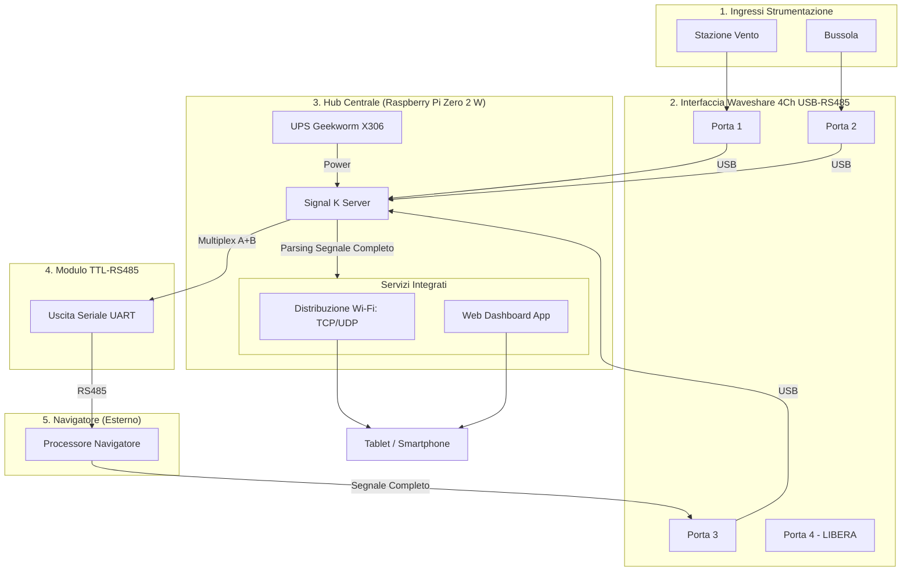

# MaMaoHub: NMEA 0183 Hub per Imbarcazioni

## Proposito del Progetto
Il progetto **MaMaoHub** ha l'obiettivo di centralizzare, multiplexare e distribuire i dati di navigazione NMEA 0183 su una barca, rendendoli fruibili sia via hardware (RS485) che via software (Wi-Fi/Web).

L'hub funge da ponte tra la strumentazione tradizionale e le moderne applicazioni di navigazione su tablet/smartphone, fornendo al contempo una dashboard web-based per il monitoraggio in tempo reale.

## Architettura del Sistema

### Diagramma di Connettività


### Elenco Componenti Hardware
1.  **Cervello**: Raspberry Pi Zero 2 W.
2.  **Alimentazione**: Geekworm X306 v1.3 UPS (con supporto allo shutdown controllato).
3.  **Hub Seriale**: Waveshare 4-Channel RS485 to USB.
4.  **Modulo RS485 Aggiuntivo**: Modulo TTL to RS485 collegato via UART (GPIO 14/15). Utilizzato per inviare il mix Vento+Bussola al Navigatore.
5.  **Navigatore (Esterno)**: Device che riceve il mix Vento+Bussola dal modulo TTL e produce il Segnale Completo per la Porta 3.

### Flusso Dati (Loop-back)
1.  **Ingresso**: MaMaoHub riceve i dati da **Stazione Vento** e **Bussola** tramite le porte 1 e 2 del Waveshare.
2.  **Multiplex**: Signal K combina i dati e li invia al **Navigatore** tramite il **modulo TTL-RS485** (UART).
3.  **Elaborazione Esterna**: Il Navigatore riceve il mix, lo processa e restituisce il **Segnale Completo** alla porta 3 del Waveshare.
4.  **Distribuzione Interna**: MaMaoHub riceve il Segnale Completo e abilita i servizi integrati:
    *   **Wi-Fi**: Distribuzione via TCP (10110) e UDP Broadcast per app come Navionics.
    *   **Web**: Dashboard integrata accessibile via browser per il monitoraggio.
5.  **Porta 4**: Rimane libera per usi futuri.

## Guida Passo-Passo all'Installazione (Primo Setup)

Segui questi passaggi per preparare la tua prima scheda SD e rendere operativo MaMaoHub.

### Fase 1: Preparazione della Scheda SD
1. **Scarica lo strumento**: Scarica e installa [Raspberry Pi Imager](https://www.raspberrypi.com/software/) sul tuo PC/Mac.
2. **Scegli il Sistema Operativo**:
   * Clicca su **CHOOSE OS**.
   * Seleziona **Raspberry Pi OS (other)** -> **Raspberry Pi OS Lite (64-bit)**.
3. **Configura le Impostazioni (Cruciale)**:
   * Clicca sull'icona dell'ingranaggio (o premi `Ctrl+Shift+X`).
   * **Hostname**: Imposta `mamaohub.local`.
   * **SSH**: Seleziona "Enable SSH" e scegli "Use password authentication".
   * **Set username and password**: Crea un utente (es. username: `pi`, password: `tua_password`).
   * **Configure wireless LAN**: Inserisci il nome (SSID) e la password del Wi-Fi della tua barca o del tuo hotspot cellulare.
   * **Set locale settings**: Imposta il fuso orario e il layout della tastiera su `it`.
4. **Scrivi**: Inserisci la micro SD nel PC e clicca su **WRITE**.

### Fase 2: Primo Avvio e Accesso
1. Inserisci la micro SD nel Raspberry Pi Zero 2 W e alimentalo tramite l'UPS Geekworm.
2. Attendi circa 2-3 minuti per il primo avvio.
3. Apri un terminale sul tuo PC (PowerShell su Windows, Terminale su Mac) e digita:
   ```bash
   ssh pi@mamaohub.local
   ```
   *(Sostituisci `pi` con l'username che hai scelto. Se `.local` non funziona, cerca l'IP del Pi nel tuo router).*

### Fase 3: Installazione Automatizzata MaMaoHub
Una volta entrato nel Raspberry Pi, copia e incolla questi comandi uno alla volta:

```bash
# 1. Installa git (se non presente)
sudo apt update && sudo apt install -y git

# 2. Scarica il progetto
git clone https://github.com/fnico/MaMaoHub.git

# 3. Entra nella cartella ed esegui l'installazione
cd MaMaoHub
chmod +x scripts/install.sh
sudo ./scripts/install.sh
```

### Fase 4: Verifica e Accesso ai Servizi
Al termine dell'installazione e dopo il riavvio richiesto:
* **Signal K Dashboard**: Apri il browser e vai su `http://mamaohub.local:3000`.
* **Wi-Fi Failover**: Se porti il Pi in un luogo dove non c'è Wi-Fi, dopo 60 secondi vedrai apparire una rete chiamata **MaMaoHub-Hotspot**. Collegati con password `mamaohub123` e naviga su `http://192.168.4.1:3000`.

---

## Funzionalità Chiave
*   **Gestione Alimentazione**: Shutdown automatico in assenza di alimentazione esterna per proteggere il file system. Auto-boot al ritorno della corrente.
*   **Standard Industriale**: Utilizzo di Signal K come motore di elaborazione dati per massima flessibilità.
*   **Accessibilità**: Dashboard personalizzate raggiungibili via browser da qualsiasi dispositivo connesso alla rete della barca.
*   **Specifiche Software**:
    *   **Sistema Operativo**: Raspberry Pi OS Lite (64-bit) basata su **Debian Bookworm** (ultima versione stabile). Una versione leggera ottimizzata per l'uso "headless" (senza interfaccia grafica).
    *   **Ambiente di Esecuzione**: **Node.js (LTS)**, necessario per far girare il cuore del sistema.
    *   **Data Server**: **Signal K Server**, lo standard open-source per l'interoperabilità dei dati marini.
    *   **Plugin Necessari**:
        *   `signalk-to-nmea0183`: Fondamentale per convertire i dati Signal K nel formato NMEA 0183 da inviare all'uscita fisica.
        *   `instrumentpanel`: Per la visualizzazione dei dati in formato analogico/digitale su browser.
        *   `signalk-kip`: Dashboard avanzata con supporto per temi scuri (ideale per la navigazione notturna).
        *   `signalk-freeboard-sk`: Per integrare mappe nautiche e posizionamento.
    *   **Utility di Sistema**:
        *   **NetworkManager**: Gestione robusta della rete Wi-Fi (configurazione Access Point o connessione a router di bordo).
        *   **Udev**: Per l'assegnazione di nomi univoci alle porte USB del Waveshare.
        *   **mamao-ups (Python/Service)**: Script personalizzato e servizio systemd per il monitoraggio del GPIO e lo shutdown sicuro.
        *   **kplex (opzionale)**: Multiplexer NMEA 0183 puro per routing ad altissime prestazioni e bassa latenza.
        *   **Git**: Fondamentale per il versionamento di `/etc/udev/rules.d/`, `settings.json` di Signal K e gli script di sistema.
