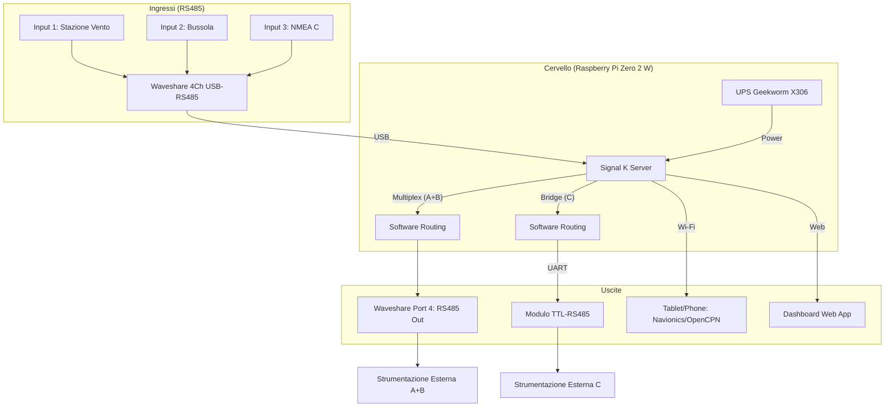

# MaMaoHub: NMEA 0183 Hub per Imbarcazioni

## Proposito del Progetto
Il progetto **MaMaoHub** ha l'obiettivo di centralizzare, multiplexare e distribuire i dati di navigazione NMEA 0183 su una barca, rendendoli fruibili sia via hardware (RS485) che via software (Wi-Fi/Web).

L'hub funge da ponte tra la strumentazione tradizionale e le moderne applicazioni di navigazione su tablet/smartphone, fornendo al contempo una dashboard web-based per il monitoraggio in tempo reale.

## Architettura del Sistema

### Diagramma di Connettività

### Elenco Componenti Hardware
1.  **Cervello**: Raspberry Pi Zero 2 W.
2.  **Alimentazione**: Geekworm X306 v1.3 UPS (con supporto allo shutdown controllato).
3.  **Interfaccia I/O Primaria**: Waveshare 4-Channel RS485 to USB.
4.  **Uscita Bridge Fisico**: Modulo TTL to RS485 collegato via UART (GPIO 14/15).
    *   **Input 1**: Stazione Vento
    *   **Input 2**: Bussola
    *   **Input 3**: Segnale NMEA C (completo)
    *   **Input 4**: Disponibile per espansioni future.

### Flusso Dati
*   **Multiplexing (Vento e Bussola)**: MaMaoHub raccoglie i dati dalla Stazione Vento e dalla Bussola, li multiplexa e li invia all'uscita fisica RS485 (Waveshare Port 4).
*   **Distribuzione Wi-Fi (Input 3)**: Solo il segnale dall'Input 3 (il segnale "completo") viene convertito e trasmesso via Wi-Fi per la compatibilità con le app di navigazione (es. **Navionics, OpenCPN, Aqua Map, iNavX**).
*   **Ponte Fisico (Input 3)**: Il segnale completo dell'Input 3 viene replicato in tempo reale verso il **modulo TTL-RS485** collegato ai pin UART del Raspberry Pi, per la condivisione con altra strumentazione.
    *   **Protocolli**: Supporto per **NMEA 0183** (frasi standard) e **Signal K** (moderno formato JSON via WebSockets).
    *   **Connettività**: 
        *   **TCP (Server Mode)**: Porta **10110** (standard industriale) per una connessione stabile e bidirezionale.
        *   **UDP (Broadcast)**: Per l'invio simultaneo a più dispositivi senza necessità di accoppiamento.
*   **Dashboard**: Una Web App integrata visualizza i dati (velocità, profondità, vento, ecc.) transitanti nell'hub.

## Strategia di Disaster Recovery
Tutte le configurazioni (OS, driver, plugin, dashboard) sono gestite tramite repository Git. In caso di fallimento della scheda SD, il sistema può essere ripristinato in pochi minuti eseguendo uno script di setup automatizzato.

## Funzionalità Chiave
*   **Gestione Alimentazione**: Shutdown automatico in assenza di alimentazione esterna per proteggere il file system. Auto-boot al ritorno della corrente.
*   **Standard Industriale**: Utilizzo di Signal K come motore di elaborazione dati per massima flessibilità.
*   **Accessibilità**: Dashboard personalizzate raggiungibili via browser da qualsiasi dispositivo connesso alla rete della barca.
*   **Specifiche Software**:
    *   **Sistema Operativo**: Raspberry Pi OS Lite (64-bit) basata su **Debian Bookworm** (ultima versione stabile). Una versione leggera ottimizzata per l'uso "headless" (senza interfaccia grafica).
    *   **Ambiente di Esecuzione**: **Node.js (LTS)**, necessario per far girare il cuore del sistema.
    *   **Data Server**: **Signal K Server**, lo standard open-source per l'interoperabilità dei dati marini.
    *   **Plugin Necessari**:
        *   `signalk-to-nmea0183`: Fondamentale per convertire i dati Signal K nel formato NMEA 0183 da inviare all'uscita fisica.
        *   `instrumentpanel`: Per la visualizzazione dei dati in formato analogico/digitale su browser.
        *   `signalk-kip`: Dashboard avanzata con supporto per temi scuri (ideale per la navigazione notturna).
        *   `signalk-freeboard-sk`: Per integrare mappe nautiche e posizionamento.
    *   **Utility di Sistema**:
        *   **NetworkManager**: Gestione robusta della rete Wi-Fi (configurazione Access Point o connessione a router di bordo).
        *   **Udev**: Per l'assegnazione di nomi univoci alle porte USB del Waveshare.
        *   **mamao-ups (Python/Service)**: Script personalizzato e servizio systemd per il monitoraggio del GPIO e lo shutdown sicuro.
        *   **kplex (opzionale)**: Multiplexer NMEA 0183 puro per routing ad altissime prestazioni e bassa latenza.
        *   **Git**: Fondamentale per il versionamento di `/etc/udev/rules.d/`, `settings.json` di Signal K e gli script di sistema.
